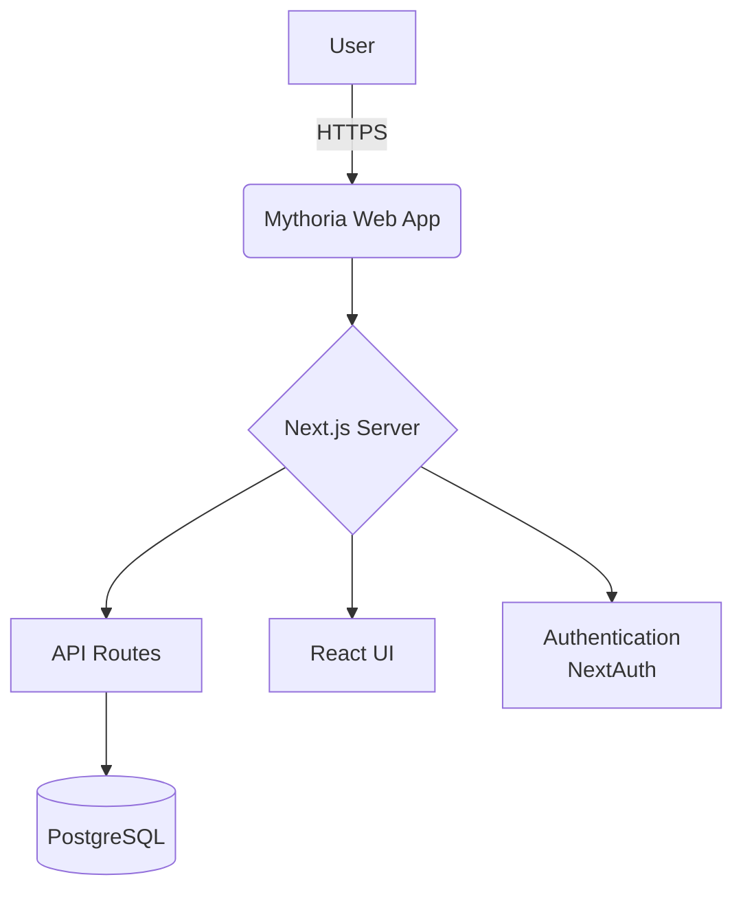

# Architecture Overview

The application is built with Next.js using the App Router. It serves both the frontend React components and backend API routes. Data is stored in a PostgreSQL database accessed through Drizzle ORM, while authentication is handled with NextAuth.js.

The system is packaged as a Docker container and deployed to Google Cloud Run.
