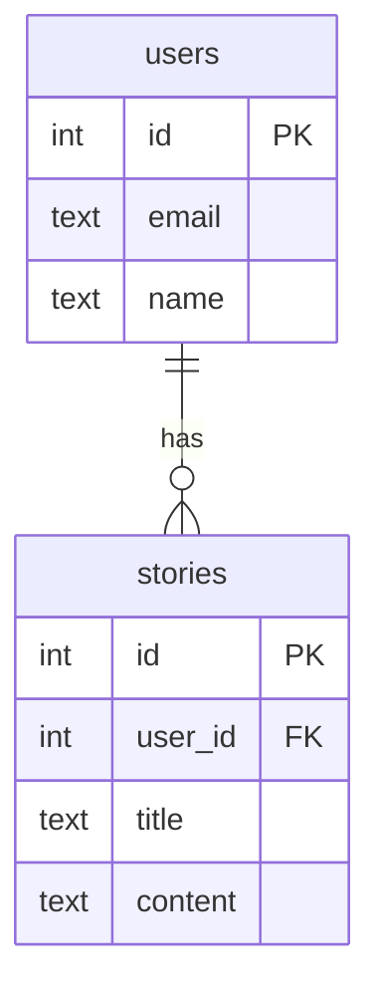

# Database

Mythoria uses PostgreSQL accessed through Drizzle ORM. The following diagram illustrates the logical data model.

### Table Definitions

- **users** – registered accounts with a unique email.
- **stories** – generated story records linked to the creating user.

Indexes and constraints are defined through Drizzle migrations.
