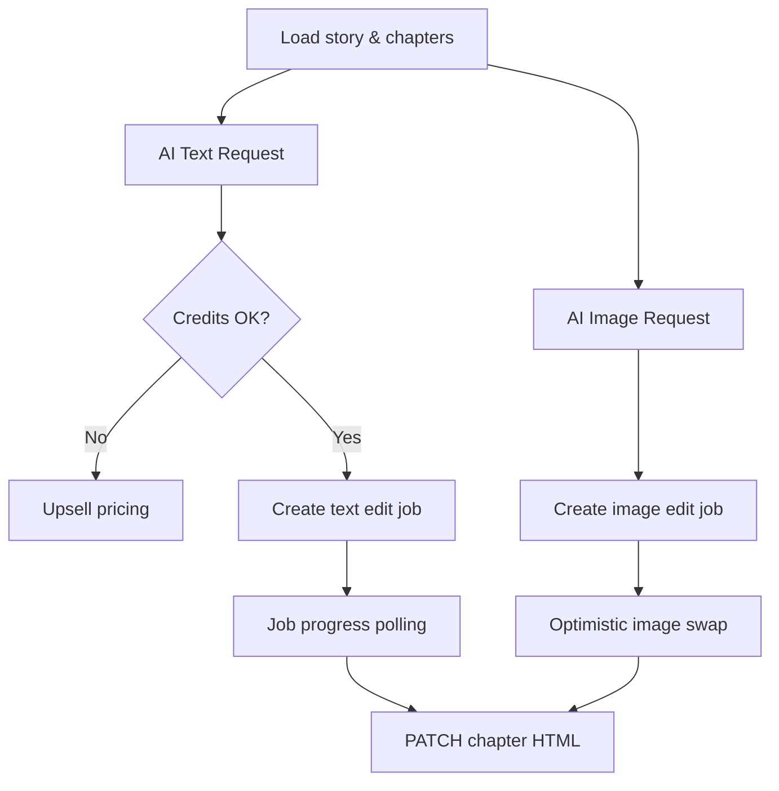

# AI Story Studio

## Mythoria's Take

When the draft is inked but the muse still whispers, the AI Story Studio is the midnight workspace that never runs out of coffee. Toggle between chapters, invite the AI co-author to punch up dialogue, translate the whole tale for cousins overseas, or drop a prompt that repaints the cover art without smudging the vibe. Every version is tucked away, so you can step back in time if a bold experiment goes sideways. It is the writer's room where Jarvis meets Jane Austen.

## Technical Deep Dive

- Entry point: `src/app/[locale]/stories/edit/[storyId]/page.tsx` pulls `/api/stories/{id}/edit`, hydrates chapters via `convertApiChaptersToChapters`, and manages modals for text edits, image edits, and full translations.
- Rich text editing: `src/components/chapter-editor/ChapterEditor.tsx` wraps Lexical with custom toolbar, autosave hooks, undo/redo powered by version history endpoints (`/api/stories/{id}/chapters/{chapterNumber}/versions`).
- AI text edits: `src/components/AITextStoryEditor.tsx` checks credit balances (`/api/ai-edit/check-credits` and `/api/ai-edit/check-full-story-credits`), launches async jobs with `createTextEditJob`, tracks progress through `JobProgressModal`, and patches updated HTML back to the chapter endpoint.
- AI image edits: `src/components/AIImageEditor.tsx` orchestrates prompt-driven edits or user uploads (with cropping, aspect validation, and GCS uploads), then applies replacements through `useImageEditJob` when credits allow.
- Translation pipeline: `src/components/TranslateFullStoryModal.tsx` queues full-story translation jobs, then redirects to the translated story when complete.
- Analytics and safeguards: every major action emits events via `trackStoryManagement`, while Clerk guards ensure only authenticated authors manipulate their content.

