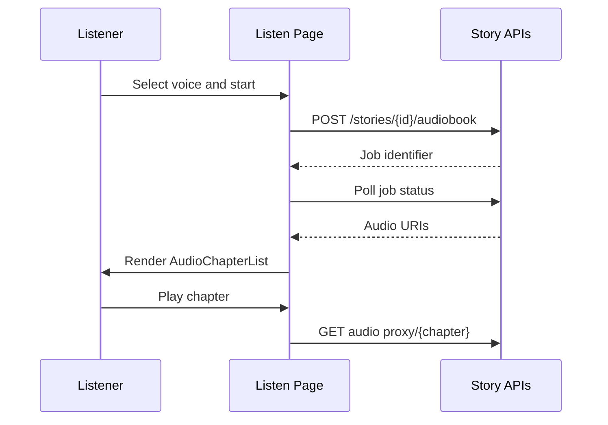

# Audiobook Forge

## Mythoria's Take

Sometimes you want to close your eyes and let the story wash over you. The Audiobook Forge lets you pick the narrator voice, check the credit cost, and conjure a full soundtrack chapter by chapter. While the AI engineers stitch the audio, playful status notes keep you posted, then the built-in player hands you speed controls, progress bars, and quick chapter jumps. It is like hiring your own voice cast without leaving the couch.

## Technical Deep Dive

- Listen surface: `src/app/[locale]/stories/listen/[storyId]/page.tsx` loads story metadata, chapters, credit balances, pricing via `/api/pricing/services`, and voice options from localized translations.
- Credit gating: the component compares user balance (`/api/my-credits`) with audiobook pricing, showing upgrade CTAs when credits fall short and triggering `/api/stories/{id}/deduct-credits` when narration begins.
- Generation loop: `handleGenerateAudiobook` calls `/api/stories/{id}/audiobook`, tracks state with `isGeneratingAudio`, and polls using `StoryGenerationProgress` semantics until files are ready.
- Playback engine: `src/components/AudioPlayer/useAudioPlayer.ts` manages HTMLAudioElement instances, auto-advances chapters, records analytics (`trackStoryManagement.listen`), and exposes progress/loading state for UI.
- Chapter UI: `src/components/AudioPlayer/AudioChapterList.tsx` displays thumbnails, duration labels, and play/pause/stop controls per chapter with graceful fallbacks when art is missing.
- Voice selection modal: the listen page renders drop-down controls with localized descriptions and ties selection to generation requests.

