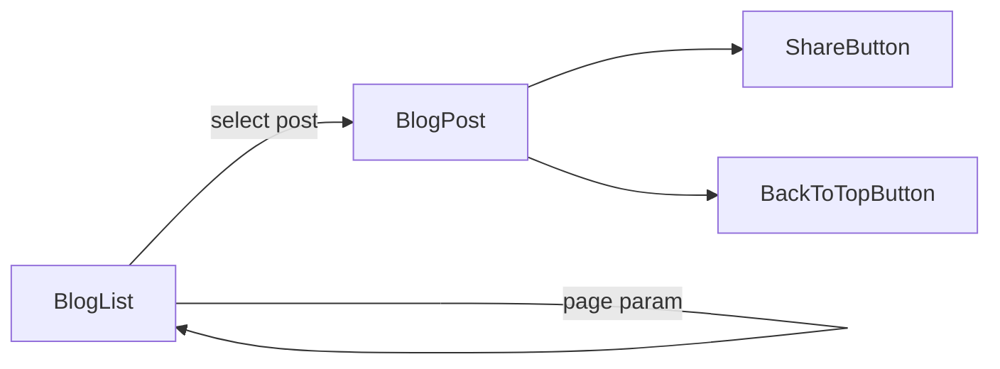

# Mythoria Blog & Editorial

## Overview

Mythoria ships a localized editorial blog that lives under the locale-aware `/[locale]/blog` routes. The experience focuses on discoverability, readable excerpts, and SEO-friendly metadata so posts can be indexed and shared consistently.

## User Experience

- **Browse posts** with a localized title/subtitle, read time indicators, and summary previews.
- **Load more entries** via the pagination control (query param `page`).
- **Open individual posts** with rich MDX content, navigation to adjacent posts, and sharing/utility actions (back to top, share).

## Implementation Notes

### Pages & Data

- **Listing page**: `src/app/[locale]/blog/page.tsx` validates supported locales, queries published posts via `blogService.getPublishedList`, calculates reading time, and renders the list with pagination links.
- **Detail page**: `src/app/[locale]/blog/[slug]/page.tsx` loads a single post, validates MDX, renders content through `MDXRemote` with GFM/slug support, and builds previous/next navigation.
- **SEO & hreflang**: metadata builders generate Open Graph data and hreflang links so each locale’s blog entry is properly indexed.

### UI Composition

- **Listing UI**: `src/components/BlogListContent.tsx` handles the card grid, summary rendering, and pagination button.
- **Blog content wrapper**: `src/components/BlogContent.tsx` centralizes the blog layout styling.
- **MDX components**: `src/lib/blog/mdx-components.tsx` provides safe components (including audio via `MDXAudioPlayer`) for post content.

### Sitemap Support

The blog index and published posts are appended to `/sitemap.xml` at runtime (`src/app/sitemap.xml/route.ts`) to keep SEO data aligned with newly published content.

