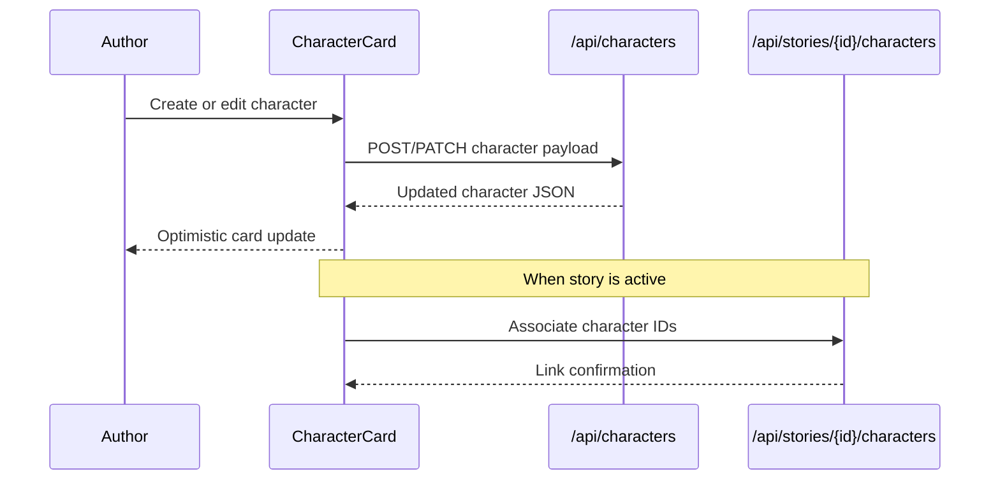

# Character Atelier

## Mythoria's Take
Ever wished you could sit at Professor Xavier's desk and assemble a dream team? The Character Atelier is exactly that. You can pull lovable goofs or brooding heroines from your personal roster, tweak their quirks, roll for new traits, or sketch an entirely fresh face before the story ink even dries. Need a dragon who hums lullabies or a grandma who raps in hexameter? Spin the hints, pick the archetype, and they spring to life. When the next chapter calls, those same characters are just a click away, ready to star in their own sequel.

## Technical Deep Dive
- Step-three workflow: `src/app/[locale]/tell-your-story/step-3/page.tsx` stitches together story-session persistence, Clerk auth, and `/api/stories/{id}/characters` to attach rosters before outline generation.
- Trait and type helpers: `src/components/CharacterCard.tsx` consumes enum utilities (`@/types/character-enums`) to render grouped selects, trait search, and hint rollers powered by translation keys.
- Optimistic CRUD: create, update, and delete actions call `/api/characters` endpoints, and the UI immediately reflects changes by mutating local state while analytics fire through `trackStoryCreation`.
- Personal library: `src/components/MyCharactersTable.tsx` surfaces the same card editor for long-term management, including delete confirmation modals and quick creation for reuse outside the wizard.
- Role awareness: helper functions translate stored roles and types into locale-aware labels, while selected characters are linked to stories through `/api/stories/{id}/characters` POST calls.

