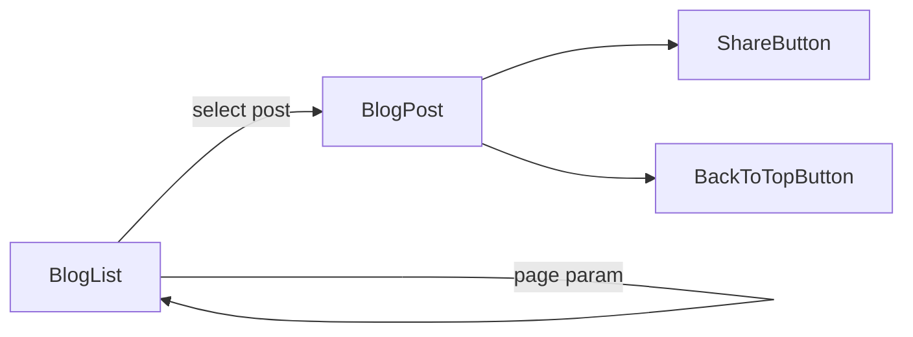

# Mythoria Blog & Editorial

## Mythoria's Take

Beyond the app lies a library of essays, behind-the-scenes peeks, and storytelling tips. Browse the feed, spot reading times, and dive into full MDX-powered articles that keep the Mythoria voice humming even when you are not crafting a chapter.

## Technical Deep Dive

- Listing page: `src/app/[locale]/blog/page.tsx` validates locales, fetches posts via `blogService.getPublishedList`, calculates reading times with `calculateReadingTimeFromMdx`, and renders responsive cards with hero images and alt text.
- Pagination: query param `page` drives offset calculations; when there are more posts than the page size, the UI surfaces a Load More button linking to the next page.
- Detail pages: `src/app/[locale]/blog/[slug]/page.tsx` loads a single post, validates MDX through `validateMdxSource`, converts it with `MDXRemote` plus `remark-gfm`/`rehype-slug`, and wires previous/next navigation.
- SEO and hreflang: metadata functions emit Open Graph info and cross-locale canonical links to keep content indexable.
- Sharing tools: posts include `ShareButton`, `BackToTopButton`, and inline markdown renderer for summaries so the reading flow remains consistent.

