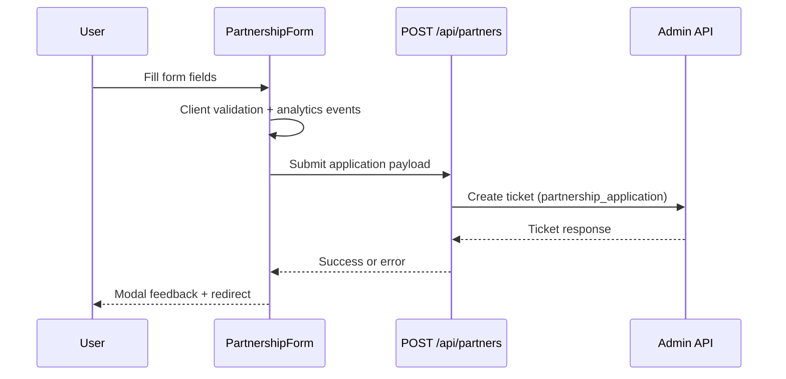
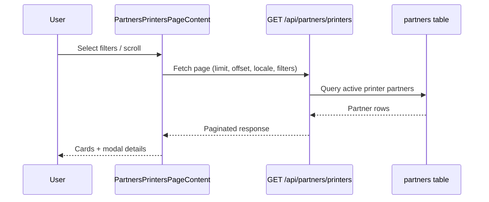

# Partners & Printing Directory

## Mythoria’s Take (End-User Guide)

Mythoria offers two partner-facing experiences:

1. **Become a Partner** – a marketing page with a partnership application form.
2. **Find a Printing Partner** – a public directory of approved print shops.

### Apply to Become a Partner

**Where to go**

- Visit `/[locale]/partners` from the main navigation (“Partners”).

**What you’ll see**

- A hero section with a primary **Apply Now** call-to-action that scrolls directly to the form.
- Three partnership categories (Printing Services, Attractions & Venues, Retailers & Brands).
- A “How it works” 3-step overview and a benefits grid.

**How to apply**

1. Fill in the required fields: **Name**, **Company name**, **Email**, **Primary location**, and **Partnership type**.
2. Optional details: **Phone**, **Website**, and a short **Business description**.
3. Submit the application.

**After submission**

- A success modal confirms the request and notes a 2–3 business day response window.
- The page automatically redirects to the homepage after ~5 seconds, with a manual “Go to Homepage” button available.
- If validation fails or the API request errors, an error modal appears with a “Try Again” action.

**Helpful details**

- If you are signed in, Mythoria auto-fills your name and email.
- If you start filling the form, Mythoria tracks the interaction for analytics (no visible UI impact).

### Find a Printing Partner

**Where to go**

- Visit `/[locale]/partners/printers` to browse print shops.

**How to search**

1. Filter by **Country** (optional).
2. Filter by **City/Region** (optional and only enabled after selecting a country).
3. Click **Clear filters** to reset.

**How results work**

- Results load in batches as you scroll (infinite scroll), with a manual **Load more** button as a fallback.
- Each partner card shows the name, logo (or placeholder), short description, and location hint.

**See details**

1. Click a partner card to open a modal.
2. The modal displays **Email**, **Mobile**, and **Address** if available.
3. The address is a Google Maps link for quick navigation.

---

## Technical Deep Dive (Developer Guide)

### Route Map & UI Composition

| Route                         | Purpose                  | Key UI                                    |
| ----------------------------- | ------------------------ | ----------------------------------------- |
| `/[locale]/partners`          | Marketing + application  | `PartnersPageContent` + `PartnershipForm` |
| `/[locale]/partners/printers` | Public printer directory | `PartnersPrintersPageContent`             |

**Page shells**

- `src/app/[locale]/partners/page.tsx` renders the marketing page and configures metadata via `Partners` translations.【F:src/app/[locale]/partners/page.tsx†L1-L53】
- `src/app/[locale]/partners/printers/page.tsx` renders the directory and configures metadata via `PartnersList` translations.【F:src/app/[locale]/partners/printers/page.tsx†L1-L53】

**Marketing page UI**

- `PartnersPageContent` composes the hero, partnership type cards, “How it works” steps, benefits, and the embedded form with a smooth-scroll CTA.【F:src/components/PartnersPageContent.tsx†L1-L213】
- The application form lives in `PartnershipForm` and runs as a client component.【F:src/components/PartnershipForm.tsx†L1-L376】

**Printer directory UI**

- `PartnersPrintersPageContent` provides filters, list cards, infinite scroll, and the partner details modal.【F:src/components/PartnersPrintersPageContent.tsx†L1-L368】
- Placeholder asset: `public/partners/partner-placeholder.svg`.

### Partnership Application Flow



**Client-side behavior**

- Required fields: name, company name, email, primary location, partnership type.
- Optional: phone, website, business description.
- Auto-fill when signed in (Clerk user data).
- Analytics: `trackPartnership.started` fires once after form interaction; `trackPartnership.submitted` fires on submit.【F:src/components/PartnershipForm.tsx†L22-L206】【F:src/lib/analytics.ts†L249-L273】

**Server API**

- Endpoint: `POST /api/partners`.
- Validation: Zod schema enforces required fields, URL format for website, and allowed partnership types.
- Backend action: creates a ticket in the admin system (`/api/tickets`) using `ADMIN_API_URL` + `ADMIN_API_KEY`.
- On failure: returns 400 (validation) or 500 (admin API error).【F:src/app/api/partners/route.ts†L1-L134】

**Configuration**

- Environment values are read from `getEnvironmentConfig` (server-only). Relevant keys:
  - `ADMIN_API_URL`
  - `ADMIN_API_KEY`
    【F:src/config/environment.ts†L1-L99】

### Printing Partner Directory Data Flow



**Client-side fetch**

- Requests `/api/partners/printers` with:
  - `limit` (page size), `offset`, `locale`.
  - Optional `countryCode` and `city` filters.
- Infinite scroll triggers when the sentinel intersects; a “Load more” button is available as a fallback.【F:src/components/PartnersPrintersPageContent.tsx†L53-L279】

**Public API contract**

- Endpoint: `GET /api/partners/printers`.
- Query parameters:
  - `limit` (default 10, max 50)
  - `offset` (default 0)
  - `countryCode` (ISO-3166-1 alpha-2)
  - `city` (free-text)
  - `locale` (used to localize the short description)
- Response:

```json
{
  "success": true,
  "items": [
    {
      "id": "uuid",
      "name": "Partner Name",
      "type": "printer",
      "logoUrl": "https://...",
      "websiteUrl": null,
      "email": null,
      "mobilePhone": null,
      "addressLine1": null,
      "addressLine2": null,
      "city": null,
      "postalCode": null,
      "countryCode": null,
      "shortDescription": "Localized short description",
      "serviceScope": null,
      "displayOrder": 1
    }
  ],
  "nextOffset": 10,
  "hasMore": true
}
```

【F:src/app/api/partners/printers/route.ts†L1-L44】【F:src/db/services/partners.ts†L5-L84】

**Database query**

- Filter rules:
  - `status = 'active'`
  - `type = 'printer'`
  - `country_code` and `city` filters (city uses case-insensitive partial match).
- Sort order: `display_order` ASC (nulls last), then `name` ASC.
  【F:src/db/services/partners.ts†L32-L74】

### Partner Directory Data Model

**Table:** `partners` (PostgreSQL via Drizzle)

- Key fields:
  - `name`, `type`, `logo_url`, `website_url`, `email`, `mobile_phone`
  - `address_line1`, `address_line2`, `city`, `postal_code`, `country_code`
  - `short_description` (JSON per locale, plus optional `default`)
  - `service_scope` (`local` | `national` | `international`)
  - `status` (`active` | `draft` | `hidden`)
  - `display_order`
    【F:src/db/schema/partners.ts†L1-L53】【F:src/db/schema/enums.ts†L232-L246】

**Localization of descriptions**

- `short_description` resolves in this order:
  1. Requested locale
  2. `default`
  3. `routing.defaultLocale`
  4. `en-US`
  5. First available value
     【F:src/db/services/partners.ts†L15-L30】

### Translations & UX Copy

- Marketing page copy: `src/messages/*/Partners.json`.
- Directory page copy: `src/messages/*/PartnersList.json`.
- Both namespaces are registered in `src/i18n/request.ts`.
  【F:src/messages/en-US/Partners.json†L1-L139】【F:src/messages/en-US/PartnersList.json†L1-L92】【F:src/i18n/request.ts†L34-L205】

### Implementation Notes & Extension Points

- **Add a new partner type**: update `partnerTypeEnum`, expand filters and UI, and add new list pages or tabs.
- **Expand filters**: derive country/city options from `partners` data instead of static arrays in `PartnersPrintersPageContent`.
- **Improve resiliency**: gracefully handle missing `logoUrl` (already falls back to a placeholder) and empty location data.
- **Add more directories**: copy the printers list flow, adjust `type`, and add translations + routes.

---

**Last updated:** September 2025
