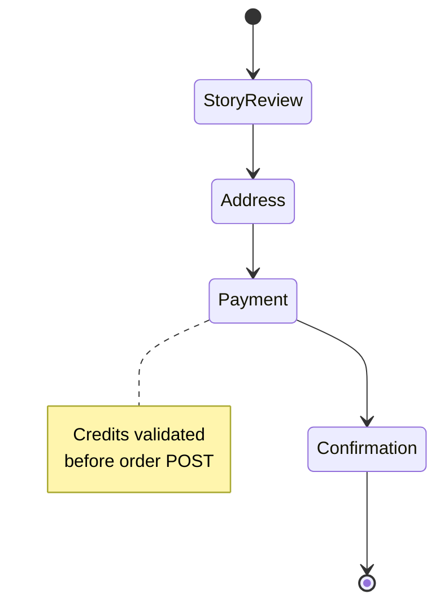

# Print Keepsake Shop

## Mythoria's Take

When a story deserves paper and ink, the Print Keepsake Shop walks you from proud author to package-at-the-door. Preview the finished book, confirm the shipping address, choose softcover or hardcover bundles, and see the credit tally update before you commit. MB Way fans even get a dedicated checkout path, because great tales should travel anywhere.

## Technical Deep Dive

- Entry route: `src/app/[locale]/stories/print/[storyId]/page.tsx` guards access with Clerk and lazy-loads the print workflow.
- Wizard core: `src/components/print-order/PrintOrderContent.tsx` coordinates the three steps (story, address, payment), fetching story metadata (`/api/stories/{id}`) and address books (`/api/addresses`).
- Story preview: `steps/StoryStep.tsx` renders synopsis and cover imagery with defensive fallbacks.
- Address management: `steps/AddressStep.tsx` embeds `AddressCard`, enabling create/edit/delete with `/api/addresses` plus auto-selection of the newest entry.
- Payment orchestration: `steps/PaymentStep.tsx` loads active print services from `/api/pricing/services`, calculates extra chapter surcharges, checks user credits (`/api/my-credits`), and provides CTAs to the pricing page when balances are low.
- Order confirmation: `handlePlaceOrder` in `PrintOrderContent` composes the payload for `/api/print-orders`, applies credit deductions, and surfaces toast notifications on success.
- Alternate payment: `src/components/MbwayPaymentModal.tsx` presents MB Way instructions (including dynamic codes returned by the order API) for manual completion.

## Self-print download flow

- Trigger points: `src/app/[locale]/stories/[storyId]/page.tsx`, `src/app/[locale]/p/[slug]/page.tsx`, and `src/app/[locale]/my-stories/page.tsx` render `SelfPrintModal` to capture the delivery email and enforce authentication on public routes before continuing.
- Pricing: the modal calls `/api/pricing/self-print`, which proxies `pricingService.getPricingByServiceCode('selfPrinting')`. Migration `0022_self_print_pricing.sql` seeds the 4-credit row for local/dev parity.
- Balance guardrails: `/api/stories/[storyId]/self-print` checks `/api/my-credits`, returns HTTP 402 on shortfalls, and only deducts credits after Story Generation Workflow `POST /print/self-service` responds with success.
- Workflow trigger: successful enqueue logs `[SelfPrint] Workflow queued` together with `storyId`, `workflowId`, `executionId`, and recipients so ops can correlate refunds and notification dispatches.
- Analytics: the modal resolves `trackStoryManagement.downloaded` with `service_code: 'selfPrinting'` so GA funnels keep self-print usage separate from keepsake orders.

