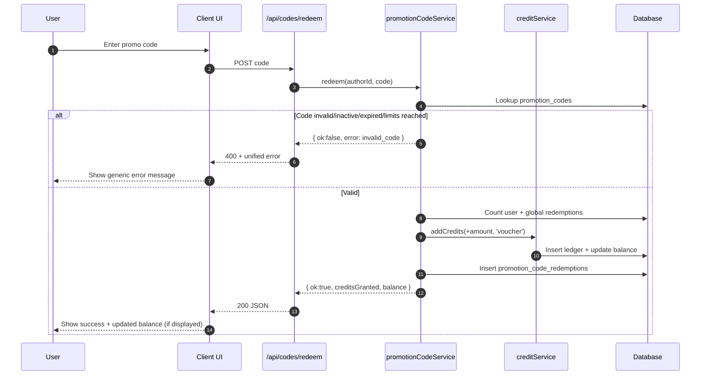

# Promo Codes

## Context

Promo Codes ("promotion codes" or vouchers) let a user receive a one‑time or limited credit bonus by entering a short code (e.g. `PARTNER10`).

Initial scope (Phase 1) implements simple Partner / Voucher codes only:

- A code maps to a fixed credit amount.
- Validation failures are intentionally collapsed to a single generic user message ("invalid or inactive code").
- Credits are granted immediately upon successful redemption.
- Each redemption is logged for auditing and future analytics.

Future phases can extend the same structure to:

- Referral codes (referrer also receives credits; track `referrerAuthorId`).
- QR / Book insert codes scanned from printed material.
- Campaign‑specific logic (e.g., multi‑step rewards, delayed payouts).

### High‑Level Flow

1. User enters code in a UI field (Buy Credits or Onboarding profile page).
2. Client calls `POST /api/codes/redeem` with `{ code }`.
3. Backend normalizes code to uppercase and validates:
   - Exists and active
   - Within optional `validFrom` / `validUntil` window
   - Does not exceed per‑user limit (`maxRedemptionsPerUser`)
   - Does not exceed global limit (`maxGlobalRedemptions`)
   - `creditAmount > 0`
4. On success: credits are added to the user's ledger as event type `voucher` and redemption is recorded.
5. Response returns new balance; UI shows success message.
6. On any failure: generic error response (`invalid_code`).

```mermaid
description
```



## UI

Promo code entry is currently available in two places:

1. **Buy Credits Page** – `src/app/[locale]/buy-credits/page.tsx`
   - Component: `PromotionCodeRedeemer`
   - Shown in the right sidebar below the cart.
   - Provides inline success/error feedback.
2. **Onboarding Profile Page** – `src/app/[locale]/profile/onboarding/page.tsx`
   - A compact instance inside the "Promo / Referral Code" card.
   - Encourages early adoption / partner code usage at first login.

### Component Behavior (`PromotionCodeRedeemer`)

- States: `idle`, `loading`, `success`, `error`.
- Disables input after success to prevent accidental re-submit.
- Normalizes nothing client‑side except trimming; server enforces uppercase.
- All non-success states except loading show one of two messages: checking / invalid.

## Database

Two tables (names in SQL + Drizzle):

### `promotion_codes`

| Column                      | Type                                     | Purpose                             |
| --------------------------- | ---------------------------------------- | ----------------------------------- |
| `promotion_code_id`         | PK (serial / integer)                    | Internal identifier                 |
| `code`                      | text (unique, uppercase)                 | Public promo code string            |
| `type`                      | text/enum (e.g. PARTNER, REFERRAL, BOOK) | Category for future branching       |
| `credit_amount`             | integer                                  | Credits granted per redemption      |
| `max_redemptions_per_user`  | integer nullable                         | Optional per-user limit             |
| `max_global_redemptions`    | integer nullable                         | Optional global cap                 |
| `valid_from`                | timestamp nullable                       | Optional start time                 |
| `valid_until`               | timestamp nullable                       | Optional end time                   |
| `referrer_author_id`        | text nullable (FK authors)               | Future use for referral attribution |
| `active`                    | boolean                                  | Soft activation flag                |
| `created_at` / `updated_at` | timestamps                               | Audit fields                        |

### `promotion_code_redemptions`

| Column                         | Type                  | Purpose                           |
| ------------------------------ | --------------------- | --------------------------------- |
| `promotion_code_redemption_id` | PK                    | Internal identifier               |
| `promotion_code_id`            | FK -> promotion_codes | Link to promo definition          |
| `author_id`                    | FK -> authors         | Redeeming user                    |
| `credits_granted`              | integer               | Amount granted at redemption time |
| `credit_ledger_entry_id`       | FK -> credit_ledger   | Links to ledger event (voucher)   |
| `created_at`                   | timestamp             | Redemption timestamp              |

### Indices & Constraints

- Unique index on `promotion_codes.code` ensures lookup speed + uniqueness.
- Optional counts done via simple `COUNT(*)` queries (acceptable for low traffic; can be optimized later with materialized counters or partial indexes).

## Business Logic

Implemented inside `promotionCodeService.redeem` (in `src/db/services.ts`):

1. Normalize input: `trim().toUpperCase()`.
2. Lookup code row; reject if missing or inactive.
3. Validate temporal window (`validFrom`, `validUntil`).
4. Enforce per-user and global redemption limits with aggregate `COUNT(*)` queries.
5. Reject if `creditAmount <= 0`.
6. Add credits via `creditService.addCredits(..., 'voucher')` (ledger insertion + balance update).
7. Insert redemption row (captures `creditsGranted` and ledger entry link).
8. Return `{ ok: true, creditsGranted, balance }`.
9. On any failure path, return `{ ok: false, error: 'invalid_code' }`.

### Design Decisions

- **Unified Error Messaging**: Reduces attack surface (no enumeration of code states) and keeps copy minimal.
- **Immediate Credit Grant**: Aligns with user expectation and reduces support friction.
- **No Locking / SERIALIZABLE** (Phase 1): Simplicity favored. If high contention emerges, introduce row-level advisory locks or atomic counter columns.
- **Future Referral Hook**: Presence of `referrer_author_id` allows crediting a second party later without schema changes.
- **Event Type**: Always `voucher` for now; can map `type=REFERRAL` to a distinct event later if analytics require separation.

### Potential Future Enhancements

| Area          | Enhancement                                                                      |
| ------------- | -------------------------------------------------------------------------------- |
| Security      | Rate limiting redemption attempts per IP/account                                 |
| Reporting     | Add aggregated views of redemption counts by type/partner                        |
| Referral      | Dual-credit logic + referral leaderboard                                         |
| Observability | Structured logging of internal failure reason before collapsing to generic error |
| Performance   | Precomputed counters or `SELECT ... FOR UPDATE` to avoid race at limit boundary  |
| Admin UI      | Create/update/deactivate codes and export stats                                  |

## API Contract

`POST /api/codes/redeem`
Request:

```json
{ "code": "PARTNER10" }
```

Success Response (200):

```json
{
  "code": "PARTNER10",
  "creditsGranted": 10,
  "newBalance": 125,
  "message": "<localized success string>"
}
```

Error Response (400):

```json
{ "error": "invalid_code" }
```

## Testing (Current State)

- A placeholder test file `src/db/promotionCodeService.test.ts` exists; comprehensive tests pending introduction of a DB test harness.

## Summary

The promo code system provides a minimal, extensible backbone for partner / voucher campaigns today, with clear extension points for referrals, QR codes, and richer campaign analytics in future iterations.
