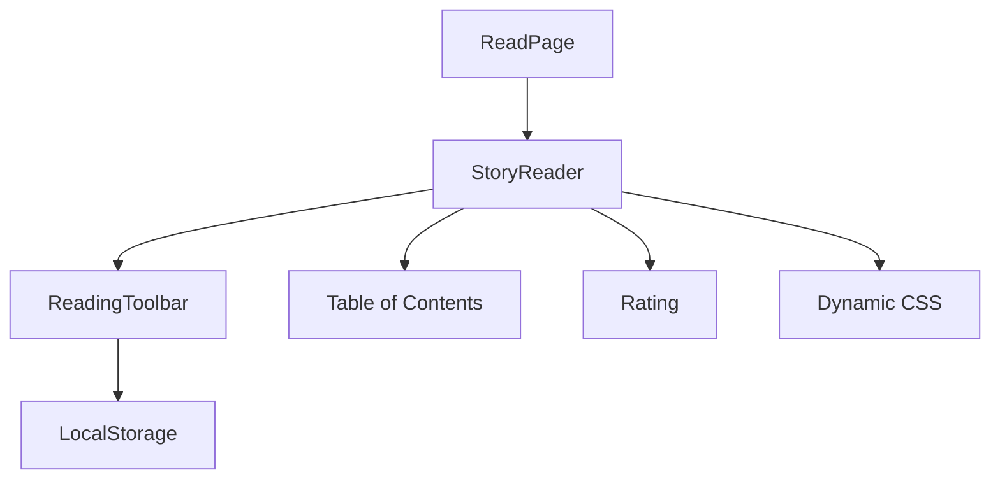

# Reader's Nook

## Mythoria's Take
Whether you are cozied up on a tablet or stealing a chapter between subway stops, the Reader's Nook keeps every page polished. Toggle font size, line height, or page margins, hop between chapters with a pocket table of contents, and enjoy covers and artwork tailored to your story's style. The interface stays tidy, even when you jump from private drafts to public showcases.

## Technical Deep Dive
- Reader shell: `src/app/[locale]/stories/read/[storyId]/page.tsx` fetches `/api/stories/{id}/chapters`, wires action bar shortcuts (read, listen, edit, print, share), and embeds `StoryReader` plus `StoryRating`.
- Presentation engine: `src/components/StoryReader.tsx` loads target-audience-specific CSS themes (`loadStoryCSS`), handles chapter navigation (private and public slugs), and scopes custom typography overrides.
- Personalization: `src/components/ReadingToolbar.tsx` manages font, line-height, and margin sliders, persisting preferences to `localStorage` and updating CSS variables in real time.
- Table of contents: `StoryReader` exposes a modal-based TOC, with navigation aware of locale-prefixed public URLs.
- Content safety: images run through `toAbsoluteImageUrl` fallback logic; missing art is gracefully hidden; dedications and synopsis blocks render when present.
- Rating hook: `src/components/StoryRating.tsx` (and its public sibling) capture feedback via `/api/stories/{id}/ratings`, surface distributions, and prompt for comments on lower scores.

