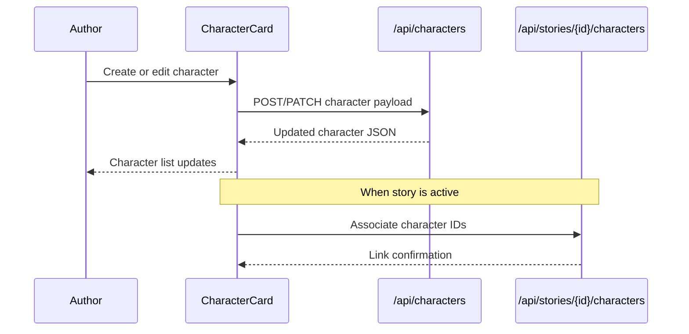

# Story Characters

## Overview

Story Characters is the authoring surface for creating, editing, and reusing characters that appear in a story. Authors can define a character’s role, type, age, traits, and descriptive notes, then attach those characters to a story during the Tell Your Story workflow. The same editor is available in the personal character library for ongoing reuse.

## User Experience

### Tell Your Story (Step 3)

- **Add characters to the current story.** Authors can create a new character or attach existing ones from their library. The characters are listed with their roles and can be edited inline.
- **Define core details.** Each character captures a name, role (e.g., protagonist, mentor), type (e.g., human, creature), age bracket, up to five traits, characteristics, and a physical description.
- **Get creative prompts.** The editor includes rollable hints for characteristics and physical description to spark ideas.
- **Attach or update a photo.** Authors can upload a character photo and optionally request an automatic description to populate the physical description field.

### My Characters (Library)

- **Manage a reusable roster.** Authors can create, edit, and delete characters outside the story workflow, then reuse them in future stories.
- **Photo enrichment is optional.** Uploading a photo can trigger an optional analysis step that suggests a physical description.

## Developer Implementation

### UI Composition

- **`CharacterCard`** is the core editor and viewer. It renders the form fields, trait selection (max 5), hint rollers, and photo upload interactions. It also emits analytics for character creation and customization.
- **`GroupedCharacterTypeSelect`** and enum helpers (`src/types/character-enums`) provide localized options for roles, types, ages, and traits.
- **`CharacterPhotoUpload`** handles image capture/upload, with optional analysis to derive a physical description.

### Story Linking & Persistence

- **Tell Your Story Step 3** (`src/app/[locale]/tell-your-story/step-3/page.tsx`) fetches story-linked characters and available characters, then associates selected characters to the story via `/api/stories/{id}/characters`.
- **Character CRUD** is handled through `/api/characters` and `/api/characters/{id}`. The library view (`MyCharactersTable`) orchestrates create/edit/delete flows and keeps local state in sync.
- **Photo upload and analysis** are driven by `/api/media/character-photo` and `/api/media/analyze-character-photo`, with optional PATCH updates back to the character record.

### Data Flow (High Level)

