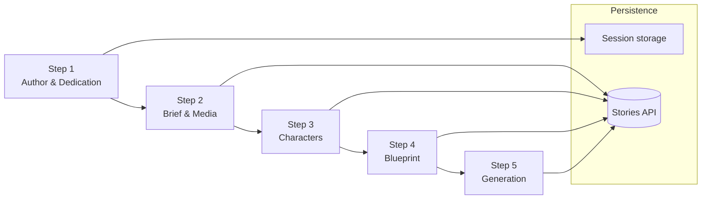

# Story Creation Forge

## Mythoria's Take
Picture grabbing a blank notebook and watching it turn into a living saga in five playful beats. Step one lets you sign the tale with your own name (or a secret pen name) and whisper a dedication to your favorite dreamer. Step two is the sandbox where you drop plot snippets, doodle-ready images, or even hum a melody for the narrator because stories are more than words. By step three, the character bench is alive: pick your hero, invite the sidekick, spin up brand-new faces with quirks that would make Tolkien grin. Step four tunes the vibe - choose the audience, wrap the style, sprinkle extra wishes - and step five is the big red button where the AI scribes go to work while you sip cocoa. The whole forge feels like pressing play on your own Pixar montage, one scene at a time.

## Technical Deep Dive
- Session-guided workflow: each stage persists via `src/lib/story-session.ts` helpers such as `setStep1Data` and `useStep2Session`, keeping drafts safe between reloads.
- Auth-aware entry: `src/app/[locale]/tell-your-story/page.tsx` funnels signed-in authors into the wizard using Clerk guards.
- Step 1 - Author imprint: `step-1/page.tsx` fetches `/api/auth/me`, seeds display names, and records analytics through `trackStoryCreation`.
- Step 2 - Multimodal brief: `step-2/page.tsx` accepts text prompts, signed media uploads through `useMediaUpload`, modal writing tips, and creates a temporary story via `/api/stories` before optional GenAI preprocessing.
- Step 3 - Character curation: `step-3/page.tsx` joins `useStorySessionGuard` with `/api/stories/{id}/characters`, while `src/components/CharacterCard.tsx` powers trait pickers, hint rollers, and optimistic edits.
- Step 4 - Story blueprint: `step-4/page.tsx` loads story data with `fetchStoryData`, enforces enums from `@/types/story-enums`, previews style selections, and recalculates chapter counts per audience band.
- Step 5 - Launch control: `step-5/page.tsx` gathers story metadata, current credits (`/api/my-credits`), service pricing (`/api/pricing/services`), deducts balances, triggers generation, and then surfaces `StoryGenerationProgress` for polling updates.

