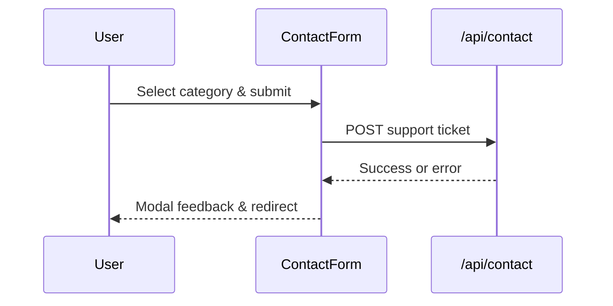

# Support Lifeline

## Mythoria's Take
When you need a teammate, the support form lets you pick the signal flare: bug, delivery question, credit puzzle, or fresh feature pitch. Signed-in authors see their name and email auto-filled, so sending a ticket is as quick as a heartbeat. Submit the note and Mythoria logs the details, shoots a gentle confirmation, and gets you back to storytelling.

## Technical Deep Dive
- Landing page: `src/app/[locale]/contactUs/page.tsx` provides the framing copy before deferring to `ContactPageContent` for the interactive pieces.
- Category shortcuts: `src/components/CategoryGrid.tsx` emits `category` query parameters, while `ContactPageContent` scrolls the user to the form and updates the URL via History API.
- Form brain: `src/components/ContactForm.tsx` hydrates defaults from Clerk (`useUser`), respects `category` query params, validates required fields, and posts payloads to `/api/contact` with analytics via `trackContact`.
- Feedback loop: success and error cases trigger modal overlays, auto-redirect to the homepage on success, and reset form state.
- Layout extras: the page includes bonus partnership messaging and community teasers, reinforcing secondary calls-to-action.

