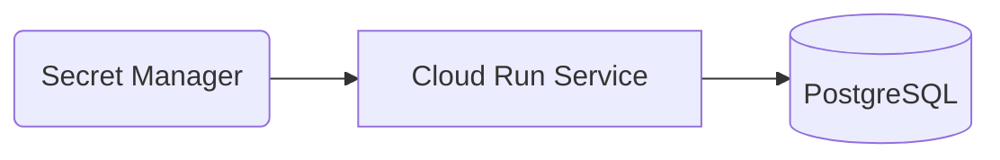

# Security & Compliance

Data is protected in transit using HTTPS and at rest through Google Cloud managed encryption. Environment variables and secrets are stored in Secret Manager and loaded at runtime.

## Threat Model

- **Data Exposure** – Mitigated via TLS and least‑privilege access.
- **Secret Leakage** – Secrets are never stored in the repository and are rotated periodically in Secret Manager.
- **Audit Trails** – Cloud Logging records application and access logs for compliance reviews.
